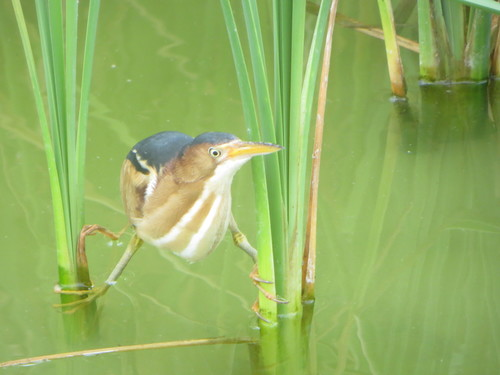

# iNaturalist Tools

Tools for automating retrieval of data and/or files from [iNaturalist](https://www.inaturalist.org).

* [Project Extractor](inat_project_extractor) (Python)
* [Photo Download](photo_download) (PowerShell)

One of my favorite [personal
photos/observations](https://www.inaturalist.org/observations/46559960), a Least
Bittern from the Leonabelle Turnbull Birding Center in Port Aransas, Texas.

## About

Copyright &copy; Stephen A. Fuqua, 2020. Available for free and unfettered use
under terms of the [MIT license](license).